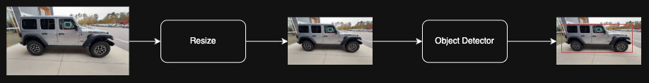

# [Project Title] 

[This template is designed to help you create a comprehensive README file for your project. It includes sections for project overview, installation instructions, usage guidelines, and more. Feel free to customize it according to your project's needs.]

[It is recommended to delete/replace the sections that are included in the brackets, since they contain guidelines on how to fill the README file, and are not meant to be included in the final version of the README.]

## Overview

[Insert a brief description of the project here, explaining its purpose and functionality.]

[Insert an image or diagram that illustrates the project architecture or workflow and inference]


## Installation

[It is recommended to use [uv](https://astral.sh/uv/) to manage dependencies and virtual environments.]

[Install uv and initialize the new project with `uv init`. To add dependencies, use `uv add` command. For example, to add `numpy`, run `uv add numpy`.]

Install all dependencies using the `uv.lock` file:

```bash
uv sync
```

### Pre-commit

Pre-commit will check for formatting compatibility of the committed code. In case of incorrect formatting, it will automatically stage formatting changes, which will have to be integrated before pushing.
It will use the [Ruff](https://docs.astral.sh/ruff/) formatter.

Run the following command to install `pre-commit`:
```bash
pre-commit install
```

#### Example
Suppose you have a file `main.py` which is not correctly formatted.

Before staging the file:
```python
def add(a,b):
   return a+b
```

When you run git commit, pre-commit automatically runs formatters and fixes the code. The pre-commit output might look like:

```
[INFO] Installing environment for https://github.com/pre-commit/pre-commit-hooks.
[INFO] Once installed this environment will be reused.
[INFO] This may take a few minutes...
🔒 security · Detect hardcoded secrets...................................Passed
🔧 uv · Update uv lockfile...............................................Passed
🔧 uv · Export uv lockfile to requirements.txt...........................Passed
🐍 python · Format Python code with Ruff.................................Failed
🐍 python · Sort imports with Ruff...................(no files to check)Skipped
📝 markdown · Format markdown........................(no files to check)Skipped
📓 notebook · Format markdown cells..................(no files to check)Skipped
📓 notebook · Strip output from Jupyter notebooks....(no files to check)Skipped
trim trailing whitespace.................................................Passed
fix end of files.........................................................Passed
check yaml...........................................(no files to check)Skipped
check for added large files..............................................Passed
🌳 git · Detect conflict markers.........................................Passed
🌳 git · Protect main branches...........................................Passed
🌳 git · Block large file commits........................................Passed
- hook id: ruff-format
- files were modified by this hook

1 file reformatted
```

After staging, the `main.py` file is updated:
```python
def add(a, b):
      return a + b
```

:warning: WARNING: The file is not staged yet, it has to be added with 
```bash
git add main.py
```
before completing the commit

## Usage

The main config file to consider is set in `configs/train.yaml`.

### 1. Data Preparation

[Describe the data preparation steps, including how to format the data, where to place it, and any specific requirements for the dataset.]

[Provide also an example of how the data should look like. TSV/CSV formats are preferable since they are easy to analyze and adapt, keeping the separation between the data paths and the labels. All paths contained in the TSV files should be relative to the root folder of the dataset, and the TSV should be placed at such root.]
The `train.tsv` file should look as follows:

```
issue   	image_filename1.jpeg
no-issue	image_filename2.jpeg
...
```

where the filenames are relative to the location of the `train.tsv` file.

[Include an example of the directory structure for the dataset, so users can easily understand how to organize their files.]

```
root_folder/
├── images/
│   ├── image1.jpeg
│   ├── image2.jpeg
│   └── ...
├── train.tsv
└── bbox.tsv  # Optional: bounding box annotations for cropping
```

#### Dataset
[Finally, include the link to the dataset (S3 bucket URL or other), if available, or instructions on how to obtain it.]

### 2. Training

[Describe how to run the training process, including any necessary configurations or parameters.]

```bash
python train.py --config configs/train.yaml
```

### 4. Testing & Plotting Metrics

**Prepare the Test Dataset**

[Similar to the training dataset, describe how to prepare the test dataset, including the format of the `test.tsv` file and any specific requirements.]

**Run the model on the test dataset**

[Describe how to run the model on the test dataset and where the predictions will be saved.]

```bash
python test.py --config config/default.yaml --ckpt weights/exposure_model.tflite
```

**Compute the metrics**

[Describe how to compute the metrics for the model predictions, including any necessary scripts or commands.]

### References
[Include any references to papers, articles, or other resources that are relevant to the project. This could include research papers, documentation for libraries used, or any other resources that helped in the development of the project.]